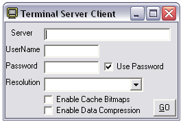



## Terminal Services Client \(Updated\)

### Description

Connects to a remote Windows 2000/XP Terminal Server which runs on port 3389.

Update

----

- Removed the full screen even at smaller resolutions

- Added Bitmap Caching to speed up image display

- Added compression to speed up data tranfers

- Added Automatic Password entry

Register the OCX before you run.

To find some servers to test on try scanning 130.39.99.1 - 130.39.100.254 for port 3389
 
### More Info
 

             |
---                |---
**Submitted On**   |2001-12-10 12:02:28
**By**             |[Chris Peneguy](https://github.com/Planet-Source-Code/PSCIndex/blob/master/ByAuthor/chris-peneguy.md)
**Level**          |Intermediate
**User Rating**    |5.0 (10 globes from 2 users)
**Compatibility**  |VB 6\.0
**Category**       |[Complete Applications](https://github.com/Planet-Source-Code/PSCIndex/blob/master/ByCategory/complete-applications__1-27.md)
**World**          |[Visual Basic](https://github.com/Planet-Source-Code/PSCIndex/blob/master/ByWorld/visual-basic.md)
**Archive File**   |[Terminal\_S4084312102001\.zip](https://github.com/Planet-Source-Code/chris-peneguy-terminal-services-client-updated__1-29641/archive/master.zip)

